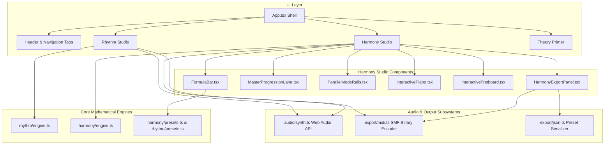

# System Architecture & Technical Specification

> Detailed architectural blueprint, mathematical foundations, data models, and audio/MIDI engine specifications for **Schillinger Tools Studio**.

---

## 1. Architectural Philosophy

Schillinger Tools Studio is designed around three foundational engineering principles:

1. **Zero External Runtime Dependencies for Music Engines:**
   All rhythmic calculations, scale/harmonic transformations, algebraic voice-leading, Web Audio percussion/chord synthesis, and binary MIDI encoding are implemented from pure first principles in TypeScript. No external sound libraries, no SoundFont loaders, and no third-party MIDI packages are utilized.
2. **Deterministic Mathematical Purity:**
   Every musical operation strictly mirrors the algebraic models formulated in Joseph Schillinger's 1941 treatise *The Schillinger System of Musical Composition*. Randomness is only introduced when explicitly requested as a permutation.
3. **Reactive Unidirectional Data Flow:**
   The application state flows strictly downward from modular studio orchestrators (`HarmonyStudioView.tsx`, `UnifiedRhythmControls.tsx`) to specialized presentation visualizers (`InteractivePiano.tsx`, `InteractiveFretboard.tsx`, `MultiLaneVisualizer.tsx`).

---

## 2. High-Level System Architecture



---

## 3. Core Data Contracts

### 3.1 Harmony Data Models (`src/core/harmony/engine.ts`)

```typescript
export type ChordStructureType = 'S5' | 'S7' | 'S9'; // Triad (3), Seventh (4), Ninth (5)

export type HarmonySystemType =
  | 'diatonic'            // Type I: Diatonic System (Book V, Ch. 2)
  | 'diatonic_symmetric'  // Type II: Diatonic-Symmetric (Book V, Ch. 4)
  | 'symmetric'           // Type III: Symmetric System (Book V, Ch. 5)
  | 'chromatic'           // Chromatic System
  | 'strata';             // Strata Harmony (Book IX)

export type VoiceLeadingMode =
  | 'greedy'              // Minimal Euclidean distance
  | 'schillinger_cw'      // Clockwise permutation: 1 -> 3 -> 5 -> 7 -> 1
  | 'schillinger_ccw'     // Counterclockwise permutation: 1 -> 7 -> 5 -> 3 -> 1
  | 'schillinger_const';  // Constant tone retention: hold shared pitches

export interface ScaleDefinition {
  id: string;
  name: string;
  category: 'diatonic' | 'synthetic' | 'symmetric';
  intervals: number[];    // Semitone offsets from root (0 to 11)
  color: string;          // Hex color for UI lane identification
}

export interface CycleMove {
  id: string;
  name: string;
  alias: string;
  stepOffset?: number;     // Scale steps modulo N (Type I & II)
  semitoneOffset?: number; // Absolute chromatic semitones (Type III)
  system?: 'diatonic' | 'symmetric';
}

export interface ChordItem {
  id: string;
  stepIndex: number;
  degreeIndex: number;
  rootPitchClass: number;  // 0 = C, 1 = C#/Db, ..., 11 = B
  rootName: string;
  chordName: string;       // e.g. "Cmaj7", "Am9", "F#7"
  quality: string;         // e.g. "maj7", "m7", "7", "m7b5", "dim7"
  pitchClasses: number[];  // Pitch classes in chord, e.g. [0, 4, 7, 11]
  voicedMidiNotes: number[]; // Exact assigned MIDI pitches [bass, upper1, upper2, ...]
  romanNumeral: string;    // e.g. "I", "ii", "IV", "viiø"
  sourceScaleId: string;   // Scale origin, e.g. "ionian", "phrygian"
  sourceScaleName: string;
  sourceColor: string;
  isCustomBorrowed?: boolean; // Set true when swapped via modal interchange
  structure?: ChordStructureType; // Per-chord density: 'S5' | 'S7' | 'S9'
  isCustomDensity?: boolean;  // Set true when overridden from global default
}
```

### 3.2 Rhythm Data Models (`src/core/rhythm/types.ts`)

```typescript
export interface GeneratorConfig {
  a: number; // Major generator
  b: number; // Minor generator
  c?: number; // Optional 3rd generator
  isFractioned?: boolean; // a ÷ _b toggle
  metricGrouping: 'ab' | 'a' | 'b';
}

export interface RhythmResultant {
  cycleLength: number;         // Common product cycle L
  durations: number[];         // Series of duration values in atomic ticks
  attackIndices: number[];     // Ticks at which an attack occurs
  accentIndices: number[];     // Indices in durations array that receive downbeat/accents
  phaseCoincidences: number[]; // Ticks where both generators strike simultaneously
  generatorAAttacks: number[]; // Attacks of generator a
  generatorBAttacks: number[]; // Attacks of generator b
  counterDurations?: number[]; // Complementary countertheme r' (for 3-generator sync)
}
```

---

## 4. Algorithmic Specifications

### 4.1 Rhythm Synchronization & Metric Accents (`src/core/rhythm/engine.ts`)

#### 1. Binary Synchronization ($r = a \div b$)
Given integers $a > b > 0$:
1. The common cycle length is $L = a \times b$.
2. Generator $a$ fires at ticks:
   $$\{0, a, 2a, \dots, (b-1)a\}$$
3. Generator $b$ fires at ticks:
   $$\{0, b, 2b, \dots, (a-1)b\}$$
4. The union set of all attacks $U = A \cup B$ is sorted in ascending order:
   $$0 = t_0 < t_1 < t_2 < \dots < t_{k-1} < L$$
5. The duration sequence is given by consecutive differences:
   $$d_i = t_{i+1} - t_i \quad \text{for } 0 \le i < k-1, \quad d_{k-1} = L - t_{k-1}$$

#### 2. Coprime Polyrhythm Metric Downbeat Accents
In polyrhythmic pairs where $\gcd(a, b) = 1$ (such as 3:2, 4:3, 5:4), the only simultaneous strike in the range $0 \le t < L$ is at $t = 0$. To represent authentic metric phrasing without leaving coprime cycles unaccented after tick 0:
- When grouped by $a$ or $ab$, every attack of Generator $a$ receives a primary metric downbeat accent.
- When grouped by $b$, every attack of Generator $b$ receives a primary metric downbeat accent.
- Phase coincidence at $t = 0$ is flagged as the macro-cycle accent.

#### 3. Fractioning Around the Axis of Symmetry ($a \div \underline{b}$)
Fractioning groups minor generator pulses into blocks of length $a$ over $L = a^2$:
- Major generator $a$ fires at $\{0, a, 2a, \dots, (a-1)a\}$.
- Minor generator $b$ fires $a$ times inside each of the $N_b = a - b + 1$ fractional groups, yielding a palindromic resultant pattern symmetric around the temporal midpoint $t = a^2 / 2$.

---

### 4.2 Harmonic Cycle Generation & Density Overrides (`src/core/harmony/engine.ts`)

#### 1. Type I Diatonic Cycles (Book V, Chapter 2)
Given parent scale pitches $P = \{p_0, p_1, \dots, p_{N-1}\}$ where $N$ is scale cardinality ($N = 7$ for diatonic, $N = 6$ for whole-tone, $N = 8$ for octatonic):
- Root degree step offset $\Delta$:
  - $C_3 \downarrow$: $\Delta = -(3 - 1) = -2 \equiv N - 2 \pmod N$
  - $C_3 \uparrow$: $\Delta = +(3 - 1) = +2 \pmod N$
  - $C_5 \downarrow$: $\Delta = -(5 - 1) = -4 \equiv N - 4 \pmod N$
  - $C_5 \uparrow$: $\Delta = +(5 - 1) = +4 \pmod N$
  - $C_7 \downarrow$: $\Delta = -(7 - 1) = -6 \equiv +1 \pmod N$ (stepwise up)
  - $C_7 \uparrow$: $\Delta = +(7 - 1) = +6 \equiv -1 \pmod N$ (stepwise down)
- Degree advances sequentially:
  $$\text{degree}_{k+1} = (\text{degree}_k + \Delta) \pmod N$$
- Chords are built by tertian skipping along the scale array:
  $$\text{pitch}_m = P[(\text{degree} + 2m) \pmod N] \quad \text{for } m = 0, \dots, M-1$$
  where $M = 3$ for $S_5$ (triad), $M = 4$ for $S_7$ (seventh), $M = 5$ for $S_9$ (ninth).

#### 2. Type II Diatonic-Symmetric Invariant System (Book V, Chapter 4)
- Roots progress through scale degrees identically to Type I.
- Pitch classes are constructed using an invariant chord density pattern (e.g. Major 7th $[0, 4, 7, 11]$, Minor 7th $[0, 3, 7, 10]$, Dominant 7th $[0, 4, 7, 10]$) transposed to each root:
  $$\text{PC}_m = (\text{root} + \delta_m) \pmod{12}$$

#### 3. Type III Symmetric Octave Divisions (Book V, Chapter 5)
Roots progress by chromatic semitones dividing the 12-semitone octave by roots of 2:
- $C_6$ ($\sqrt{2}$): $\Delta_{\text{st}} = 6$ (2 tonics)
- $C_4$ ($\sqrt[3]{2}$): $\Delta_{\text{st}} = 4$ (3 tonics, e.g., $C \to E \to A\flat \to C$)
- $C_3$ ($\sqrt[4]{2}$): $\Delta_{\text{st}} = 3$ (4 tonics, e.g., $C \to E\flat \to F\sharp \to A \to C$)
- $C_2$ ($\sqrt[6]{2}$): $\Delta_{\text{st}} = 2$ (6 tonics)
- $C_1$ ($\sqrt[12]{2}$): $\Delta_{\text{st}} = 1$ (12 tonics)
- $C_0$: $\Delta_{\text{st}} = 0$ (static root with voice permutation)

Roots advance in chromatic pitch-class space $\mathbb{Z}_{12}$:
$$\text{root}_{k+1} = (\text{root}_k + \Delta_{\text{st}}) \pmod{12}$$

#### 4. Dynamic Per-Chord Density Rebuilding (`rebuildChordWithStructure`)
When an individual chord or range of chords is reassigned a density ($S_5, S_7, S_9$):
1. The chord retains its `rootPitchClass`, `degreeIndex`, and `sourceScaleId`.
2. The tertian pitch classes are reconstructed using the target density.
3. The chord symbol, quality, and Roman numeral are refreshed via `identifyChord`.
4. The chord is marked with `isCustomDensity = true` so the selection persists across global formula and scale adjustments.

---

### 4.3 Algebraic Voice-Leading Engine (`applySchillingerVoiceLeading`)

Voice leading assigns exact MIDI register numbers to every pitch class in each chord.

1. **Bass Line Constraints:**
   - Bass pitch class $p_{\text{root}}$ is positioned strictly in the octave range $[36, 55]$ ($C_2$ to $G_3$):
     $$\text{MIDI}_{\text{bass}} = p_{\text{root}} + 12k \quad \text{such that } 36 \le \text{MIDI}_{\text{bass}} \le 55$$
2. **First Chord Upper Voices:**
   - Upper pitch classes $\{p_1, \dots, p_{M-1}\}$ are placed in the octave range $[55, 76]$ around Middle C ($C_4 = 60$).
3. **Subsequent Chords ($k \ge 1$):**
   Given previous upper voicing notes $V_{\text{prev}} = [v_0, \dots, v_{P-1}]$ and current upper pitch classes $U = [u_0, \dots, u_{numUpper-1}]$:

   - **Greedy Minimal Motion:**
     For each $i \in [0, numUpper - 1]$, select the octave of $u_i$ minimizing absolute distance:
     $$\text{MIDI}_i = \arg\min_{c \in [52, 84], c \equiv u_i \pmod{12}} |c - v_{i \pmod P}|$$

   - **Clockwise Transformation ($T_{\circlearrowright}$):**
     Each voice shifts factor roles forward ($1 \to 3 \to 5 \to 7 \to 1$). Target pitch class for index $i$ is:
     $$u_{\text{target}} = U[(i + 1) \pmod{numUpper}]$$
     The octave is chosen to smoothly approach $v_{i \pmod P}$.

   - **Counterclockwise Transformation ($T_{\circlearrowleft}$):**
     Each voice shifts factor roles backward ($1 \to 7 \to 5 \to 3 \to 1$). Target pitch class for index $i$ is:
     $$u_{\text{target}} = U[(i - 1 + numUpper) \pmod{numUpper}]$$

   - **Constant Tone Transformation ($T_{\text{const}}$):**
     Preserves common tones in their exact registers. If $u_i \pmod{12} \equiv v_j \pmod{12}$ for an unheld previous note $v_j$, voice $i$ is assigned $v_j$ statically. Remaining unassigned voices step smoothly to the nearest octave of $u_i$.

4. **Multi-Density Voice Adaptation:**
   Because all voice-leading transformations map over the current chord's upper pitch classes $U$, transitions between chords of differing densities ($S_5 \to S_7$, $S_9 \to S_5$) naturally expand or contract voice count without dropping notes or creating orphan pitches.

---

## 5. Audio Subsystem (`src/core/audio/synth.ts`)

The Web Audio API service operates as an autonomous audio pipeline:

```
[AudioContext Destination]
         ^
         |
   [Master Gain]
     ^       ^
     |       |
[Perc Gain] [Chord Gain]
     ^       ^
     |       +-- [Polyphonic Oscillator Bank (Sine + Triangle)]
     |           [Exponential Decay Envelope: 1.8s - 3.2s]
     |
     +-- [Generator A: 680 Hz Bandpass Woodblock]
     +-- [Generator B: 1100 Hz High-Q Resonant Clave]
     +-- [Resultant R: 420 Hz Lowpass Resonant Rimshot]
     +-- [Accented Hits: +6dB Gain Boost + Transient Peaking]
```

- **Scheduling:** Uses lookahead scheduling with high-resolution timestamps (`audioContext.currentTime`) to eliminate timing jitter and browser main-thread stutter.
- **Dynamic Previews:** Whenever a chord density or scale is changed, `audioService.playVoicedChord` immediately auditions the newly voiced chord.

---

## 6. Standard MIDI File Binary Encoder (`src/core/export/midi.ts`)

The MIDI export engine writes valid Standard MIDI Files (SMF Format 0, single multi-channel track) directly to an in-memory `Uint8Array`.

### 6.1 Binary Byte Layout
1. **Header Chunk (`MThd`):**
   - Chunk Type: `4D 54 68 64`
   - Length: `00 00 00 06` (6 bytes)
   - Format: `00 00` (Format 0)
   - Track Count: `00 01` (1 track)
   - Division / PPQ: `01 E0` (480 pulses per quarter note)
2. **Track Chunk (`MTrk`):**
   - Chunk Type: `4D 54 72 6B`
   - Length: 32-bit unsigned integer (byte count of track data)
   - Track Data Events:
     - Set Tempo Meta Event (`FF 51 03 [Microseconds Per Quarter]`)
     - Time Signature Meta Event (`FF 58 04 nn dd cc bb`)
     - Channel Note-On Events (`90 [Note] [Velocity]`) preceded by Variable-Length Delta Times
     - Channel Note-Off Events (`80 [Note] [00]`) preceded by Variable-Length Delta Times
     - End of Track Meta Event (`FF 2F 00`)

### 6.2 Variable-Length Quantity (VLQ) Encoding
Delta times are encoded using standard 7-bit continuation bit serialization:
$$\text{byte}_k = (\text{val} \gg (7 \times k)) \ \& \ 0\text{x}7\text{F} \ | \ 0\text{x}80$$

---

## 7. Verification & Automated Testing

The Vitest suite covers 22 automated test scenarios:
- **`src/core/rhythm/engine.test.ts` (7 tests):** Validates binary sync, fractioning, trinomial interference, circular permutations, retrograde inversions, and coprime downbeat accent allocations.
- **`src/core/harmony/engine.test.ts` (9 tests):** Validates diatonic cycle progressions (Kozlov 28-chord matrix, Romanesca ground), Type II invariant chords, Type III symmetric octave divisions (Coltrane changes, Tritone polarity), per-chord density rebuilding ($S_5, S_7, S_9$), and all four algebraic voice-leading modes.
- **`src/core/harmony/presets.test.ts` (2 tests):** Validates all 11 curated harmonic presets and cycle mapping rules.
- **`src/core/rhythm/presets.test.ts` (2 tests):** Validates rhythmic preset integrity and generator metadata.
- **`src/core/export/midi.test.ts` (2 tests):** Validates binary header chunks, track lengths, variable-length quantity serialization, and polyphonic note events.
